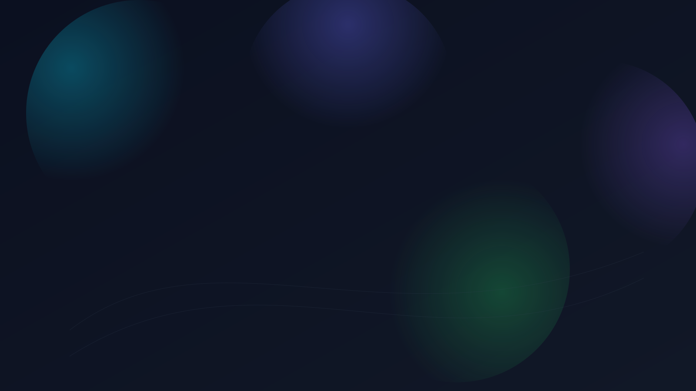

# Thought Pattern Mapping, Habitus33

개인 지식이 곧 AI의 문맥이 되는 학습 가속 플랫폼

인디고 계열 브랜딩 · 빠른 가치 체감 · 프라이버시 우선

<!-- Screenshot placeholder -->

---

# 고객의 현재 문제
<!-- Screenshot placeholder -->

- 메모·하이라이트가 흩어져 실행 가능한 지식으로 승격되지 않음
- AI가 나의 맥락을 모른 채 “일반적인” 답만 제공 → 시간 낭비
- 패턴 파악/자료 회수 비용이 큼 → 생산성 병목

---

# 한 줄 해결
<!-- Screenshot placeholder -->

최소 입력으로 메모/생각 흐름의 패턴을 매핑(TPM)하고,
AI가 곧바로 이해·활용 가능한 지식 캡슐(AI‑Link)로 제공

---

# 핵심 가치
<!-- Screenshot placeholder -->

- 입력 마찰 최소화: 읽기/하이라이트 → 자동 노트화
- 체계적 진화: 생각추가·연결·퀴즈로 메모를 지식으로 승격
- 즉시 활용: LLM‑ready 캡슐(JSON‑LD)로 외부 AI가 바로 이해
- 측정과 개선: 인지 지표로 학습 루프를 닫아 품질을 계속 향상

---

# AMFA 4단계
<!-- Screenshot placeholder -->

- A: Atomic Reading/Memo — 3분 집중으로 핵심 추출
- M: Memo Evolution — 1줄 메모를 심화(생각·연결·퀴즈)
- F: Focused Note — 단권화 노트로 구조화
- A: AI‑Link — LLM이 바로 읽는 캡슐로 공유/활용

---

# 사용자 여정(요약)
<!-- Screenshot placeholder -->

읽기/하이라이트 → 반추 메모 자동 노트화 →
진화(생각·연결·퀴즈) → 지식 카트 → 단권화 노트 →
AI‑Link 생성(공유/활용) → 하이브리드 검색/AI 대화 → 인지 피드백

---

# 데모 1: 캡처/생성
<!-- Screenshot placeholder -->

- TS 3분 집중 종료 시 반추 메모 자동 저장(노트화)
- PDF 선택→메모도 원클릭 저장
- 효과: 기록 마찰 최소화, 놓침 없이 맥락 확보

---

# 데모 2: 진화/정리
<!-- Screenshot placeholder -->

- 생각추가/메모진화/지식연결/퀴즈카드로 지식 승격
- 지식 카트에 담아 순서·책 맥락 유지한 단권화 노트 생성
- 효과: 흩어진 메모를 실행 가능한 지식으로 정리

---

# 데모 3: AI 활용
<!-- Screenshot placeholder -->

- 단권화 노트 → AI‑Link 공개 URL 생성
- 외부 LLM이 JSON‑LD를 파싱해 사용자 맥락을 즉시 이해
- 하이브리드 검색 결과를 AI 대화 컨텍스트로 주입

---

# 데이터 아키텍처(개요)
<!-- Screenshot placeholder -->

- 수집: 세션·메모·하이라이트
- 저장: 노트/단권화 노트(순서·출처 유지)
- 캡슐화: AI‑Link(JSON‑LD, 개인 온톨로지 컨텍스트)
- 소비: 검색/AI/공유, 추적: 인지 지표

---

# 하이브리드 검색 + AI 대화
<!-- Screenshot placeholder -->

- 키워드 + 벡터 결합으로 개인 지식 정밀 회수
- 결과를 컨텍스트로 AI 채팅에 전달 → “내 지식 기반 답변”
- 가치: 회수 시간 단축, 정확도/신뢰도 향상

---

# 인지 피드백(젠고)
<!-- Screenshot placeholder -->

- 플레이 결과 → 인지 지표(시계열/강약점/추천)
- 루틴 최적화로 다음 학습의 질 향상
- 데이터 기반 개인화 학습 코칭

---

# 차별화
<!-- Screenshot placeholder -->

- 대체재: 일반 메모앱 + 범용 AI → 맥락 결핍, 수작업 많음
- Habitus33: 단권화→AI‑Link 캡슐, 검색→대화 연결, 인지 피드백 루프 내장
- 결과: TPM 경험과 지속적 학습 가속

---

# 차별화 표(요약)

| 항목 | Mem.ai | Obsidian | Notion AI | Habitus33 |
|---|---|---|---|---|
| 단권화(Focused Note) | △ | △ | △ | ✅ |
| AI‑Link 캡슐(JSON‑LD) | △ | ✕ | ✕ | ✅ |
| 하이브리드 검색→대화 브리지 | △ | △ | △ | ✅ |
| 인지 피드백 루프(젠고) | ✕ | ✕ | ✕ | ✅ |

---

# 보안/프라이버시(요점)
<!-- Screenshot placeholder -->

- 사용자 데이터 소유권 우선, 최소 권한·목적 제한
- 캡슐 공유 범위 통제(공개/비공개·기간·키 옵션 설계 예정)
- 감사 가능한 로그와 안전한 저장(원칙 기반)

---

# 고객 가치/ROI
<!-- Screenshot placeholder -->

- 지식 회수/적용 시간 단축 → 생산성 향상
- 학습 정착률 상승 → 재학습 비용 감소
- 팀 온보딩/내부 지식 활성화 → 중복작업/실수 감소

---

# 성과 지표(예시)
- 학습 시간 25% 단축
- 기억 보존률 4배 향상
- 문서화/보고 시간 30% 절감

---

# 가격/플랜(예시)
<!-- Screenshot placeholder -->

- Free: 핵심 독서·메모·기본 젠고
- Pro: 무제한 생성, 심층 분석, 고급 루틴, 할인 혜택
- Premium: 프리미엄 콘텐츠/커뮤니티, 얼리 액세스, 전담 지원

---

# 적용 시나리오
<!-- Screenshot placeholder -->

- 학습자: 시험 대비 지식 캡슐로 AI 튜터 활용
- 연구자: 문헌 하이라이트→단권화→맥락형 AI 보조
- 직장인: 업무 노트→AI‑Link→보고/문서 자동화 가속

---

# 다음 단계(콜투액션)
<!-- Screenshot placeholder -->

3분 데모로 내 지식 캡슐 만들기 →
팀 파일럿(2주) → 결과 리뷰 & 최적화 → 본 도입

연락처: contact@habitus33.com  ·  단축 URL: https://habitus33.com/demo

