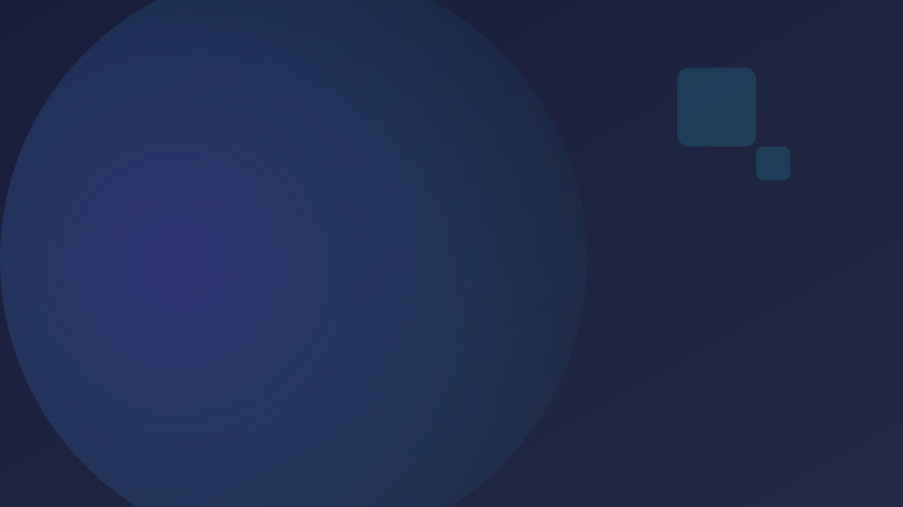
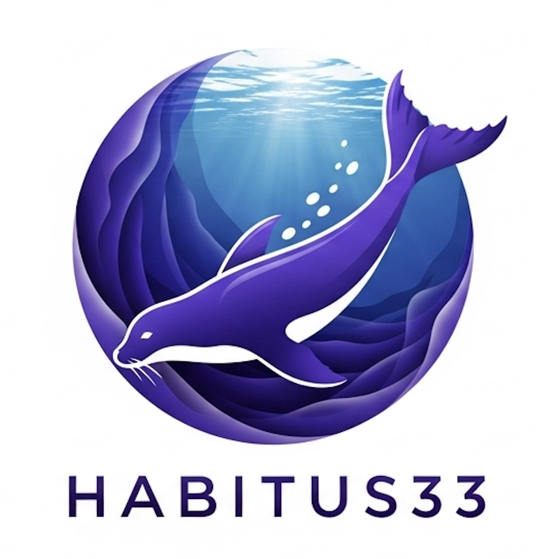
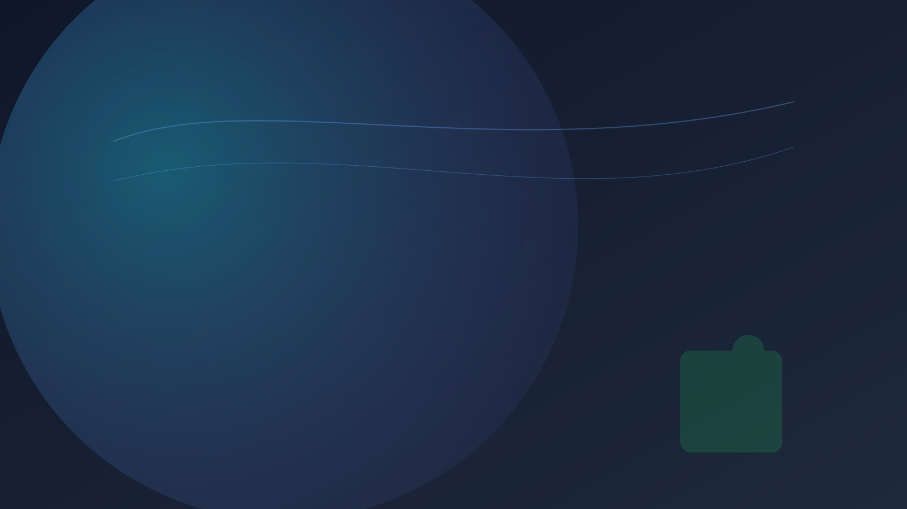
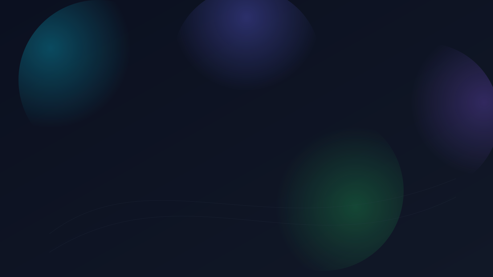

# Prompt Free, Habitus33

Professional Edition — 업무 지식을 AI‑준비 자산으로

---

# 직장인의 현재 문제

- 회의/문서/메모가 사일로화, 재활용 어려움
- LLM 답변이 팀/회사 맥락을 반영하지 못함
- 보고/제안/요약 반복 업무 비효율

---

# 해결: 업무 지식 캡슐화

업무 노트→단권화→AI‑Link로 컨텍스트 공유
검색/대화에서 “우리 팀의 맥락”을 바로 활용

---

# AMFA 적용

- Atomic Memo(핵심 포인트 3분 요약)
- Memo Evolution(의도/리스크/의존성 연결)
- Focused Note(문서/보고 구조화)
- AI‑Link(LLM‑ready 캡슐)

---

# 워크플로우(요약)

기록→정리→단권화→AI‑Link →
하이브리드 검색→맥락형 AI 문서화/보고 자동화

---

# 데모 1: 빠른 캡처

- 회의 노트/링크 원클릭 저장
- 반추 메모 자동화로 놓침 최소화

---

# 데모 2: 구조화/연결

- 이해관계자/의사결정/리스크 연결
- 단권화로 재사용 가능한 지식자산화

---

# 데모 3: 문서 자동화

- AI‑Link 컨텍스트로 보고/요약/슬라이드 생성 가속
- 품질 표준화와 시간 단축

---

# 개인 지식 검색 + 대화

- 키워드+벡터 결합으로 바로 회수
- 컨텍스트 주입 Q/A로 정확한 산출물

---

# 차별화(직장인 관점)

- 단권화→AI‑Link로 “팀 컨텍스트형” 자동화
- 반복 보고/요약 공수 대폭 절감

---

# 결과/ROI

- 문서화 시간 단축, 정확성 향상
- 온보딩/지식 이전 가속

---

# 플랜(예시)

- Free: 기본 기능
- Pro: 무제한/심층 분석/고급 루틴
- Premium: 팀/권한/프리미엄 콘텐츠

---

# 콜투액션

3분 데모 → 팀 파일럿(2주) → 본 도입

