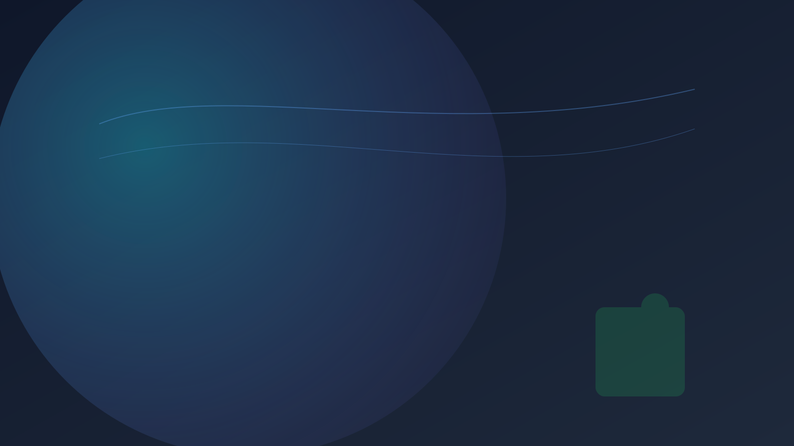

# Thought Pattern Mapping, Habitus33

Researcher Edition — 문헌‑메모를 AI‑준비 지식으로

---

# 연구자의 현재 문제

- 방대한 문헌 하이라이트가 흩어짐, 재사용성 낮음
- LLM이 도메인 컨텍스트/용어 계층을 충분히 반영 못함
- 리뷰/초록/도표 생성 반복 부담

---

# 해결: 컨텍스트 보존형 캡슐화

문헌 하이라이트→메모→단권화 노트→AI‑Link(JSON‑LD)
도메인 온톨로지 문맥을 LLM에 직접 전달

---

# AMFA 적용

- Atomic Memo(논문 단락 요약)
- Memo Evolution(근거/연결/인용 정리)
- Focused Note(섹션 구조 유지)
- AI‑Link(용어/관계 캡슐)

---

# 워크플로우(요약)

PDF 선택→메모 → 단권화(순서/출처 유지) →
하이브리드 검색 → AI 요약/리뷰/표 생성

---

# 데모 1: 문헌 캡처

- 하이라이트→원클릭 메모 저장
- 반추 메모 자동화로 맥락 손실 최소화

---

# 데모 2: 구조화/관계화

- 생각추가/연결로 개념 그래프 강화
- 단권화 노트에 출처·순서 보존

---

# 데모 3: 캡슐 활용

- AI‑Link로 도메인 컨텍스트 주입
- 리뷰 초안/도표/요약 자동 생성 가속

---

# 개인 지식 검색 + 대화

- 키워드+벡터 검색으로 관련 연구 즉시 회수
- 결과를 컨텍스트로 질의 → 정확한 인용/근거 포함

---

# 차별화(연구자 관점)

- 도메인 온톨로지 보존, 출처·순서 일관 관리
- 외부 LLM에 직접 주입 가능한 JSON‑LD 캡슐

---

# 결과/ROI

- 리서치 합성 속도·품질 동시 개선
- 중복 검색/요약 공수 절감

---

# 플랜(예시)

- Free: 기본 수집/검색
- Pro: 무제한/심층 분석/AI‑Link 확장
- Premium: 팀 공유/리뷰 파이프라인

---

# 콜투액션

샘플 논문으로 3분 데모 → 연구 캡슐 즉시 생성

