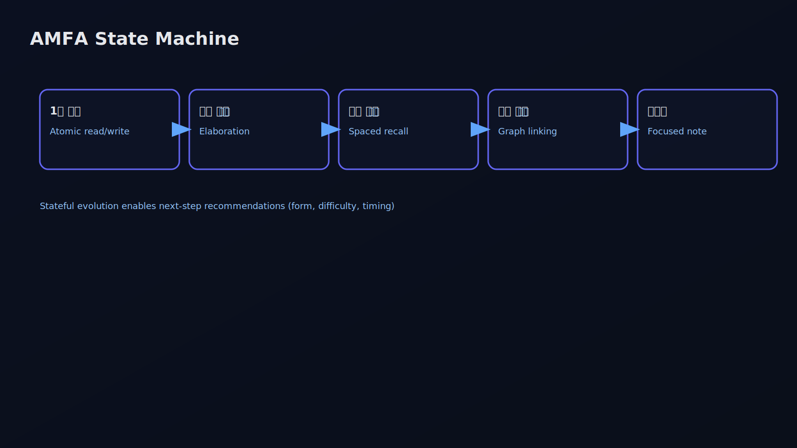

# Habitus33 — 생각의 방향·질·리듬을 추적하는 AI

사고 과정(trajectory)에 맞춘 차세대 개인화 AI 플랫폼

---

# 기술적 테제(Thesis)
- 기존 AI: “내용 스냅샷” 중심 → 문맥·타이밍·난이도는 주변부
- Habitus33: “사고 과정(방향·질·리듬)”을 계측→예측→개입
- 목표: 다음 생각이 언제·어떻게·어느 난도로 갈지 유도

---

# Before → After (Outcomes)

---

# 시스템 아키텍처(개요)
- 캡처 레이어: 세션·하이라이트→메모 자동화(마찰↓)
- 진화 레이어: 생각추가/연결/퀴즈/단권화 상태기계
- 캡슐화 레이어: AI‑Link(JSON‑LD, 타임라인 포함)
- 검색/대화 레이어: 하이브리드 검색→대화 컨텍스트 주입
- 피드백 레이어: 젠고 인지지표로 루프 닫기

---

# 사고 리듬 파이프라인(Time & Rhythm)
- 신호: 타임스탬프, 단계 간 Δt, 버스티니스, 재방문 간격
- 지표: 규칙성/주기성, 스페이싱, 피로/몰입도 추정
- 용도: 개인 리듬에 맞춘 타이밍 추천(언제)

---

# 사고 진화 상태기계(State Machine)
- 상태: 1줄메모→생각추가→기억강화→지식연결→단권화
- 전이: 정규화된 액션 로그로 방향성 계산(요약→추론→응용)
- 용도: 다음 단계/형식/난이도 추천(어떻게)

---

# 품질(Quality) 신호 융합
- 자기평가/퀴즈 성과/태그 일관성/수정 패턴/재사용률
- 복합 지표로 생각의 깊이·정확성·정합성 추정
- 용도: 권고 난이도·길이·형식 튜닝(어느 정도)

---

# 인지 리듬 측정(젠고 기반)
- first‑click latency, inter‑click intervals, hesitation
- spatial/temporal errors, sequential accuracy
- 작업기억·주의·처리속도 지표로 사고 리듬 보정

---

# 의미 공간의 방향 추적(Semantic Trajectory)
- 메모 임베딩의 시간차 벡터(semantic drift)
- 연결 그래프 중심성/모듈성 변화
- 주제 전환 각도/속도, 수렴·발산 경향/창발성 탐지

---

# Next‑Thought / Next‑Step 예측·개입
- 다음 전이 확률, 적절 간격, 권고 형식/난이도
- 개입: 질문 프롬프트, 연결 후보, 퀴즈/요약 권고
- 목표: 생각의 이동을 더 잘 유도

---

# AI‑Link Temporal Capsule(JSON‑LD)
- executive summary + timeline + actions + graph hints
- 외부 LLM이 사고의 시계열·방향성까지 즉시 소비
- 공개/비공개 캡슐(만료/키/토큰)로 보안·공유 통제

---

# 하이브리드 검색→대화 브리지
- 키워드+벡터 결합 검색(개인 스코프)
- 검색 결과 세트를 대화 컨텍스트로 주입(RAG+리듬)
- “현재 사고 위치/다음 전이”를 반영한 응답 경험

---

# 기술적 해자(Moat)
- 스냅샷이 아닌 ‘사고 궤적’ 표준화(이벤트소싱 수준)
- 타임라인 캡슐 규격+빌더 체인(AI‑Link)
- 인지 로그 결합으로 리듬 정밀도↑
- 브리지 UX(검색→대화) 체감 가치↑
- 누적 효과: 개인화 모델이 시간과 함께 개선

---

# 데이터·네트워크 효과
- 개인 누적: 캡슐 품질/검색 정확/대화 품질 지속 상승
- 익명 집계: 추천/템플릿/튜토리얼 고도화(프라이버시 준수)
- 캡슐 공유: 외부 LLM과 상호운용성 확대

---

# 안전성 & 프라이버시
- 비공개 캡슐 기본값, 만료·토큰·스코프 제어
- 공유 전 PII/민감정보 자동 탐지·마스킹
- 감사 로그/접근 제어, 정책 가드레일

---

# Real‑World Impact

---

# KPI(핵심지표)
- 리듬 적합도: 권고 타이밍 대비 Δt 개선
- 전이 성공률: 권고 채택/완료 및 후속 품질 상승
- 성과: 테스트/생산물 품질 개선, 캡슐 재사용률

---

# 로드맵(고가치)
- Thought Rhythm Model v1(타이밍 개인화)
- Directional Policy v1(다음 단계/난이도)
- Semantic Trajectory v1(발산·수렴·창발성)
- Temporal Capsule v2(전이/간격/성과 요약 포함)
- Safety Layer(PII/정책 검사)

---

# 콜투액션
3분 데모 → 2주 파일럿 → 롤아웃
연락처: contact@habitus33.com · https://habitus33.com/demo

