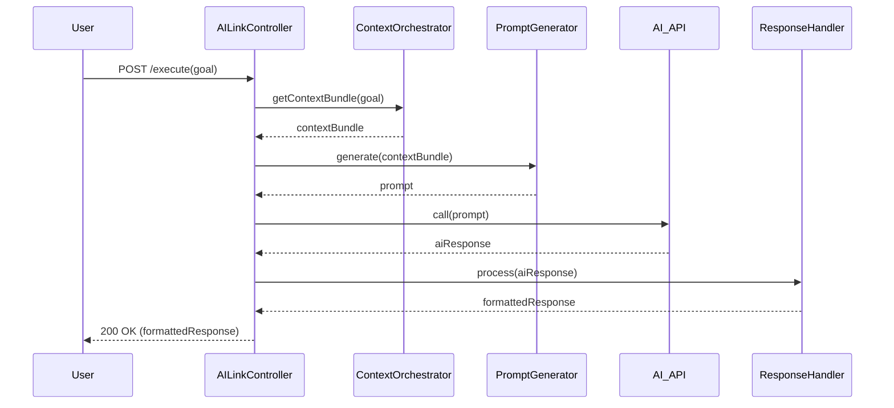

# Habitus33 서비스 모듈 아키텍처

## 1. 개요

AI-Link 워크플로우 엔진은 3개의 핵심 서비스 모듈이 파이프라인 형태로 협력하여 동작합니다. 이 문서에서는 각 모듈의 역할과 상호작용을 설명합니다.

## 2. 모듈 상호작용 다이어그램

## 3. 모듈별 상세 설명

### 1) `ContextOrchestrator`

-   **역할**: 지휘자. 사용자의 목표(`aiLinkGoal`)를 받아 지식 그래프에서 가장 관련성 높은 컨텍스트 '재료'들을 모아 `ContextBundle`을 만듭니다.
-   **핵심 메서드**: `getContextBundle(goal: string): Promise<ContextBundle>`
-   **주요 로직**:
    -   `private queryGraph(goal: string)`: GraphDB에 SPARQL 쿼리를 실행하여 관련 노트를 조회합니다. (현재는 Mock)
    -   향후 쿼리 결과에 대한 랭킹, 필터링 로직이 추가될 예정입니다.

### 2) `PromptGenerator`

-   **역할**: 레시피 개발자. `ContextBundle`이라는 '재료'를 가지고 AI 모델별 '최적의 레시피(프롬프트)'를 만듭니다.
-   **핵심 메서드**: `generate(bundle: ContextBundle, query: string): any`
-   **주요 로직**:
    -   '전략 패턴(Strategy Pattern)'을 사용하여 모델(`openai`, `claude`)별 프롬프트 생성 로직을 분리합니다.
    -   `OpenAIPromptStrategy`: `messages` 배열 형식을 사용합니다.
    -   `ClaudePromptStrategy`: `<context>` XML 태그를 사용한 단일 문자열 형식을 사용합니다.

### 3) `ResponseHandler`

-   **역할**: 요리사 및 기록가. AI의 '날것' 응답을 사용자가 보기 좋은 '요리'로 만들고, 그 과정에서 얻은 새로운 '지식'을 다시 지식 그래프에 '기록'합니다.
-   **핵심 메서드**:
    -   `formatForDisplay(): FormattedResponse`: 사용자에게 보여줄 최종 결과물을 생성합니다.
    -   `extractNewKnowledge(): NewKnowledgeTriple[]`: 응답에서 새로운 지식 트리플을 추출합니다.
-   **주요 로직**:
    -   `private findCitations(...)`: AI 답변의 근거가 된 출처(사용자의 노트)를 식별하여 신뢰도를 높입니다. 